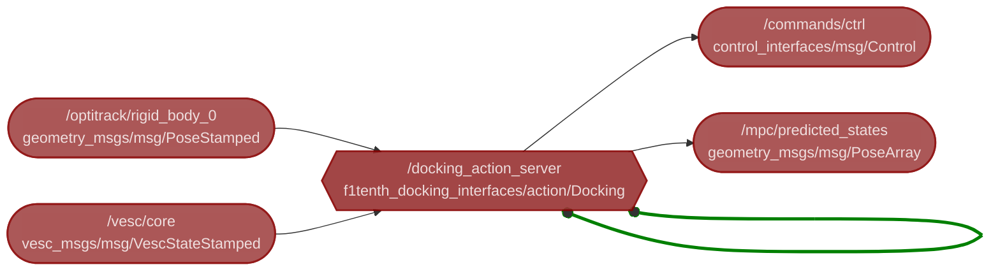

# F1/10 Docking
This package is used to dock the F1/10 car to the docking station.

https://github.com/user-attachments/assets/38e4b18c-22fa-417f-a523-3d733db8694e




### How to test

Edit the config file:
```bash
nvim f1tenth_docking/config/config.yaml
```

Start the docking action server:
```bash
ros2 launch f1tenth_docking f1tenth_docking.launch.py
```

Mock the vesc servo pose:
```bash
ros2 topic pub -r 100 /vesc/core vesc_msgs/VescStateStamped '{state: {servo_pose: 0.0}}'
```

Mock the optitrack pose:
```bash
ros2 topic pub -r 100 /optitrack/rigid_body_0 geometry_msgs/PoseStamped '{pose: {position: {x: 1.0, y: 2.0, z: 3.0}, orientation: {x: 0.0, y: 0.0, z: 0.0, w: 1.0}}}'
```

Set the control loop setpoint:
```bash
ros2 action send_goal docking_action_server f1tenth_docking_interfaces/action/Docking "{setpoint: {x_pos: 497, y_pos: 2.0, theta: 0.0, delta: 0.0}}"
```
